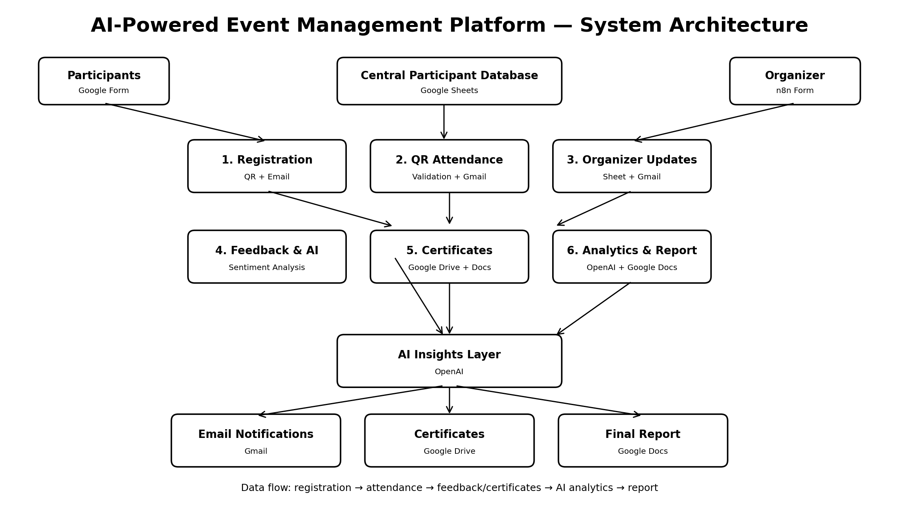

# AI-Powered Event Management Platform 🚀

**Assignment 7 – AI Event Management | Built with n8n**

## 1. Overview
An AI-powered automation platform that coordinates the complete event lifecycle: participant registration, QR-based attendance, organizer updates, feedback analysis, automated certificates, and event performance reporting.

## 2. Problem Statement
Organizations running conferences, workshops, hackathons and training programs often manage registration, attendance, communication, certificates and feedback manually. This causes delays, errors, repeated work and limited visibility into participant satisfaction.

## 3. Objectives
- Automate event registration and attendance
- Improve participant communication
- Generate certificates automatically
- Collect and analyze participant feedback
- Produce event performance reports

## 4. Solution Architecture


## 5. Workflows

### 01 — Registration & Participant Management
**Flow:** n8n Form → Edit Fields → JavaScript → Google Sheets → QR Code API → Gmail

Creates a participant record, generates an identifier/QR code and sends confirmation.

### 02 — QR Attendance System
**Flow:** n8n Form → Google Sheets lookup → IF validation → Mark Present → Gmail

Validates the participant record, marks attendance and sends a confirmation. Invalid submissions follow a separate branch.

### 03 — Organizer Event Update
**Flow:** n8n Form → Google Sheets → Gmail

Stores organizer announcements and sends event updates.

### 04 — Feedback Collection & Event Analytics
**Flow:** Google Sheets Trigger → OpenAI → Google Sheets

Analyzes feedback and classifies sentiment as **Positive, Negative, or Neutral**.

### 05 — Certificate Generation
**Flow:** Get Rows → Eligibility IF → Google Drive Copy → Google Docs update → Google Sheets

Generates certificates for eligible/attended participants and records certificate status.

### 06 — Event Analytics & Report Generation
**Flow:** Get Rows → OpenAI → Google Docs → Google Sheets

Creates an AI-generated event performance report containing insights, trends and recommendations.

## 6. Technology Stack
- n8n
- Google Forms / n8n Forms
- Google Sheets
- Gmail
- Google Drive
- Google Docs
- OpenAI
- QR Code API
- JavaScript

## 7. Key Features
- End-to-end event automation
- QR code generation
- Attendance validation
- Automated email notifications
- AI sentiment analysis
- Automated certificate generation
- AI event analytics and reporting
- Conditional branching
- Data logging through Google Sheets

## 8. Repository Structure
```text
ai-event-management-platform/
├── workflows/
│   ├── 01_registration_participant_management.json
│   ├── 02_qr_attendance_system.json
│   ├── 03_organizer_event_update.json
│   ├── 04_feedback_event_analytics.json
│   ├── 05_certificate_generation.json
│   └── 06_event_analytics_report.json
├── assets/
│   ├── architecture_diagram.png
│   └── screenshots/
├── Workflow_Documentation.docx
├── README.md
└── LICENSE
```

## 9. How to Run
1. Import the six workflow JSON files into n8n.
2. Configure Google and OpenAI credentials.
3. Connect the required Google Sheets, Drive and Docs resources.
4. Verify form fields and sheet column names.
5. Test registration first.
6. Test attendance with a registered participant.
7. Test organizer updates.
8. Submit sample feedback and verify AI sentiment.
9. Generate a certificate for an eligible attendee.
10. Run the final analytics/report workflow.

## 10. Demo Scenario
A participant registers for an AI Hackathon → receives a QR/confirmation → attendance is validated → event feedback is analyzed by AI → an eligible attendee receives a certificate → organizers receive an AI-generated event report.

## 11. Results
The solution demonstrates automation across the event lifecycle while reducing repetitive manual work and improving participant communication, data consistency and reporting speed.

## 12. Future Enhancements
- WhatsApp/SMS notifications
- Real-time organizer dashboard
- Advanced attendance analytics
- Payment gateway integration
- Multiple event/session support
- Automated certificate email delivery
- Human approval for sensitive organizer communications
- Retry/error notification workflow


